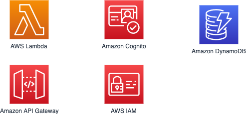

# Auth for Serverless Applications Workshop

In this workshop, you will learn how to use Amazon Cognito for user signup, signin and managing the WildRydes rider profile. This application architecture demonstrates end-to-end authentication and authorization patterns through the use of Amazon Cognito, Amazon API Gateway, AWS Lambda, and AWS Identity and Access Management (IAM).

## Getting Started

Workshop URL: [https://auth.serverlessworkshops.io](https://auth.serverlessworkshops.io)

## Want to contribute?

Check our [contribution guidelines](CONTRIBUTING.md) before submitting a pull request. Please submit your contributions to the `dev` branch.

## License

This library is licensed under the MIT-0 License. See the LICENSE file.

